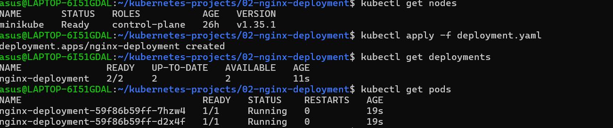

# Kubernetes Nginx Deployment

## Overview
This project demonstrates how to deploy an Nginx application on Kubernetes using a Deployment.

## Technologies Used
- Kubernetes
- Minikube
- kubectl
- Nginx

## Project Structure

```
02-nginx-deployment/
├── deployment.yaml
└── README.md
```

## Deployment YAML

- Deployment
- 2 Replicas
- Nginx Container
- Port 80

## Commands Used

```bash
kubectl apply -f deployment.yaml
kubectl get deployments
kubectl get pods
```

## Output

Deployment:

```bash
kubectl get deployments
```

Pods:

```bash
kubectl get pods
```

## Learning Outcomes

- Kubernetes Deployment
- YAML Structure
- Labels and Selectors
- Replica Management
- Container Image
- Pod Creation
## Screenshot


