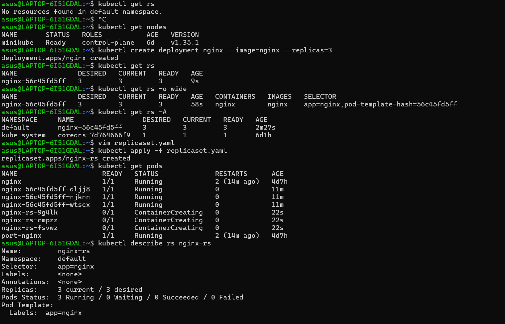
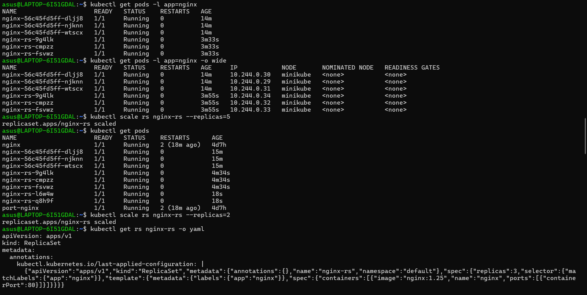
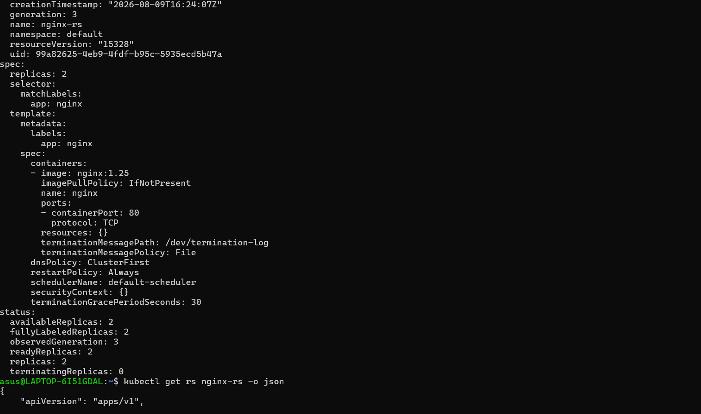
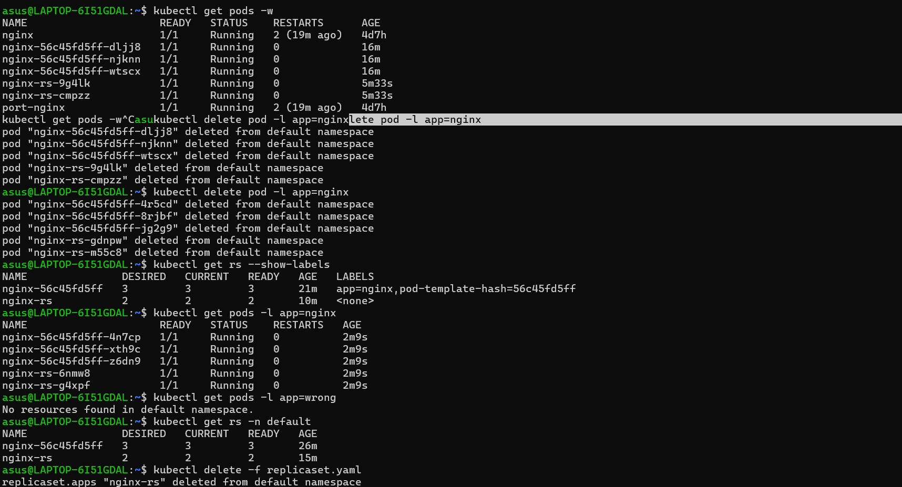

# Kubernetes ReplicaSet – Hands-On Practice

This project demonstrates the practical use of **Kubernetes ReplicaSets** using Minikube.

The goal of this lab was to understand how ReplicaSets maintain the desired number of Pods, perform self-healing, scale applications, and use labels/selectors to manage Pods.

---

## 📁 Project Structure

```text
06-replicaset/
├── replicaset.yaml
├── screenshots/
│   ├── rp1.png
│   ├── rp2.png
│   ├── rp3.png
│   └── rp4.png
└── README.md
```

---

## 🎯 Objectives

* Understand what a ReplicaSet is
* Create a ReplicaSet using YAML
* Create and manage multiple Pods
* Understand `replicas`
* Understand labels and selectors
* Practice ReplicaSet scaling
* Test ReplicaSet self-healing
* Delete Pods and observe automatic recreation
* Inspect ReplicaSet configuration and events
* Practice important Kubernetes commands

---

## 🛠️ Technologies Used

* Kubernetes
* Minikube
* kubectl
* Docker
* YAML
* WSL2 / Ubuntu

---

# 1. ReplicaSet YAML

The ReplicaSet was created using the following configuration:

```yaml
apiVersion: apps/v1
kind: ReplicaSet

metadata:
  name: nginx-rs

spec:
  replicas: 3

  selector:
    matchLabels:
      app: nginx

  template:
    metadata:
      labels:
        app: nginx

    spec:
      containers:
      - name: nginx
        image: nginx:1.25
        ports:
        - containerPort: 80
```

### Important Configuration

| Configuration       | Meaning                                   |
| ------------------- | ----------------------------------------- |
| `kind: ReplicaSet`  | Creates a ReplicaSet                      |
| `replicas: 3`       | Maintains 3 Pods                          |
| `selector`          | Identifies Pods managed by the ReplicaSet |
| `matchLabels`       | Matches Pods with `app=nginx`             |
| `template`          | Blueprint used to create Pods             |
| `image: nginx:1.25` | Container image                           |
| `containerPort: 80` | Container application port                |

---

# 2. Create ReplicaSet

```bash
kubectl apply -f replicaset.yaml
```

Verify:

```bash
kubectl get rs
```

```bash
kubectl get pods
```

The ReplicaSet creates and maintains **3 Pods**.

---

# 3. Inspect ReplicaSet

```bash
kubectl describe rs nginx-rs
```

This command provides detailed information about:

* ReplicaSet name
* Namespace
* Selector
* Desired replicas
* Current replicas
* Ready replicas
* Pod information
* Events

---

# 4. Check Pods Managed by ReplicaSet

```bash
kubectl get pods -l app=nginx
```

The `-l` option means **label selector**.

This command displays only Pods having:

```text
app=nginx
```

---

# 5. ReplicaSet Scaling

### Scale from 3 → 5 Pods

```bash
kubectl scale rs nginx-rs --replicas=5
```

Verify:

```bash
kubectl get rs
kubectl get pods
```

### Scale from 5 → 2 Pods

```bash
kubectl scale rs nginx-rs --replicas=2
```

Kubernetes terminates the extra Pods so that the desired number becomes 2.

---

# 6. ReplicaSet Self-Healing

One of the most important ReplicaSet features is **self-healing**.

First, check the Pods:

```bash
kubectl get pods
```

Delete one Pod:

```bash
kubectl delete pod <pod-name>
```

Then check:

```bash
kubectl get pods
```

The ReplicaSet automatically creates a replacement Pod.

### Why?

The ReplicaSet continuously compares:

```text
Desired Pods = 3
Current Pods = 2
```

It detects the difference and creates another Pod:

```text
Current Pods = 3
```

Therefore:

```text
ReplicaSet
    ↓
Maintains desired number of Pods
    ↓
Pod deleted
    ↓
ReplicaSet detects difference
    ↓
New Pod created
```

---

# 7. Delete Multiple Pods

```bash
kubectl delete pod -l app=nginx
```

This deletes all Pods matching:

```text
app=nginx
```

The ReplicaSet automatically recreates the required number of Pods.

---

# 8. Watch Pod Recreation

The following command continuously watches Pod changes:

```bash
kubectl get pods -w
```

In another terminal, delete a Pod:

```bash
kubectl delete pod <pod-name>
```

The watch output allows you to observe the Pod terminating and a replacement Pod being created.

---

# 9. Labels and Selectors

ReplicaSets use **labels and selectors** to identify the Pods they manage.

ReplicaSet selector:

```yaml
selector:
  matchLabels:
    app: nginx
```

Pod template label:

```yaml
labels:
  app: nginx
```

These values must match.

```text
ReplicaSet Selector
       |
       | app=nginx
       ↓
Pod Label
       |
       | app=nginx
       ↓
      MATCH
       ↓
ReplicaSet manages Pod
```

If the selector and Pod labels do not match, the ReplicaSet cannot correctly manage the Pods.

---

# 10. Important Commands Practiced

```bash
kubectl get rs
```

Display ReplicaSets.

```bash
kubectl get rs -o wide
```

Display ReplicaSets with additional information.

```bash
kubectl describe rs nginx-rs
```

Show detailed ReplicaSet information.

```bash
kubectl get rs nginx-rs -o yaml
```

Display the ReplicaSet configuration in YAML.

```bash
kubectl get pods
```

Display Pods.

```bash
kubectl get pods -l app=nginx
```

Display Pods matching the `app=nginx` label.

```bash
kubectl get pods --show-labels
```

Display Pods along with their labels.

```bash
kubectl scale rs nginx-rs --replicas=5
```

Scale the ReplicaSet.

```bash
kubectl delete pod <pod-name>
```

Delete a specific Pod.

```bash
kubectl delete pod -l app=nginx
```

Delete Pods matching a label.

```bash
kubectl get pods -w
```

Watch Pod changes in real time.

```bash
kubectl delete rs nginx-rs
```

Delete the ReplicaSet.

---

# 11. Mistakes & Troubleshooting During This Lab

### Mistake 1 – Trying to execute the YAML file

Initially, I accidentally ran:

```bash
~/replicaset.yaml
```

This produced:

```text
Permission denied
```

### Why?

Linux interpreted the YAML file as a command that should be executed.

A YAML file is a **configuration file**, not an executable program.

Correct commands are:

```bash
cat replicaset.yaml
```

to read it,

```bash
vim replicaset.yaml
```

to edit it,

and:

```bash
kubectl apply -f replicaset.yaml
```

to apply it to Kubernetes.

---

### Mistake 2 – YAML was initially outside the Kubernetes project

The `replicaset.yaml` file was initially located in:

```text
/home/asus/replicaset.yaml
```

The Kubernetes projects were stored in:

```text
/home/asus/kubernetes-projects/
```

I moved the YAML into the correct project directory using:

```bash
mv ~/replicaset.yaml .
```

The `.` means:

```text
current directory
```

Final location:

```text
kubernetes-projects/
└── 06-replicaset/
    └── replicaset.yaml
```

This keeps the GitHub project organized and makes each Kubernetes topic a separate hands-on project.

---

### Mistake 3 – Understanding file vs Kubernetes resource

A very important distinction learned during this project:

Having:

```text
replicaset.yaml
```

inside the project directory does **not** mean the ReplicaSet exists in Kubernetes.

The YAML file is only the desired configuration.

The actual Kubernetes resource is created with:

```bash
kubectl apply -f replicaset.yaml
```

So:

```text
replicaset.yaml
      ↓
kubectl apply
      ↓
Kubernetes API Server
      ↓
ReplicaSet
      ↓
Pods
```

---

# 12. Screenshots

### ReplicaSet Creation



### ReplicaSet and Pods



### ReplicaSet Scaling / Self-Healing



### ReplicaSet Verification



---

# 🧠 Key Learnings

Through this lab, I learned that a ReplicaSet:

1. Maintains a desired number of Pods.
2. Uses labels and selectors to identify Pods.
3. Automatically recreates deleted Pods.
4. Can scale Pods up or down.
5. Uses a Pod template to create new Pods.
6. Can be inspected using `kubectl describe`.
7. Is normally managed by a Deployment in real-world Kubernetes applications.

### Core Concept

```text
Deployment
    ↓
ReplicaSet
    ↓
Pods
    ↓
Containers
```

ReplicaSets are mainly responsible for **maintaining Pod replicas**, while Deployments provide higher-level application rollout and update capabilities.

