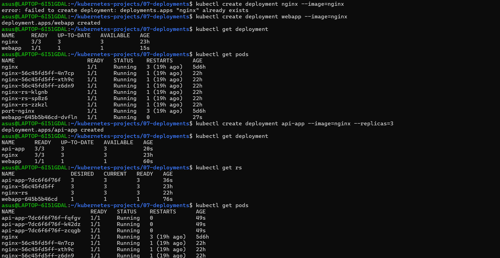
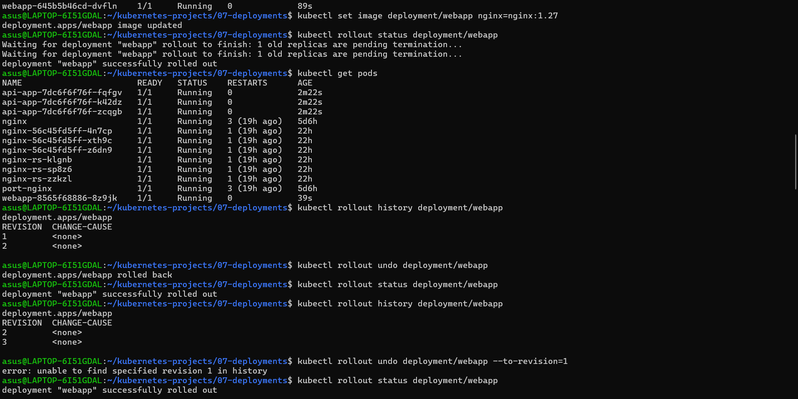
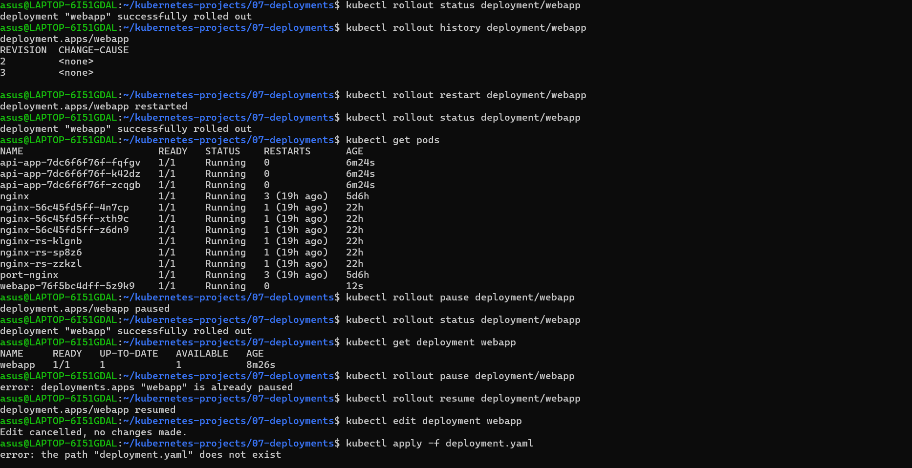
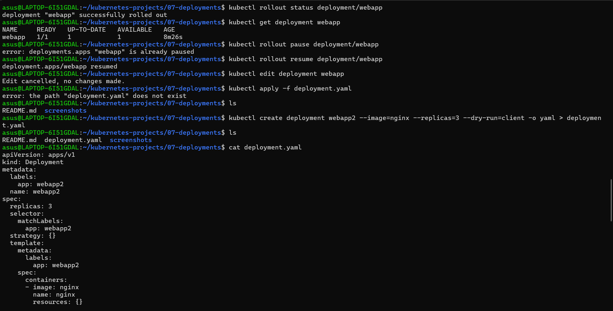
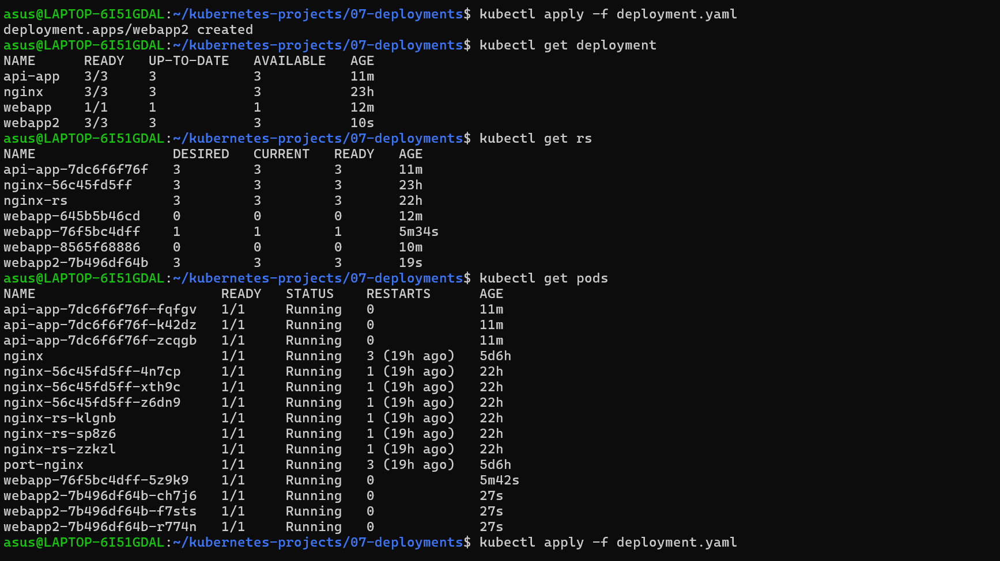
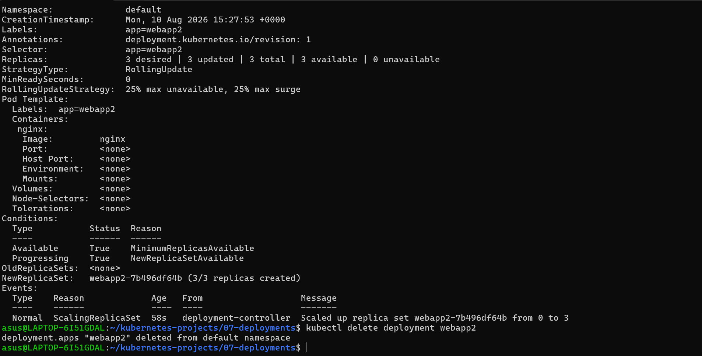

# Kubernetes Deployments – CKA Practice

This project covers important **Kubernetes Deployment commands** required for CKA preparation.

## 📁 Project Structure

```text
07-deployments/
├── deployment.yaml
├── README.md
└── screenshots/
    ├── dep1.png
    ├── dep2.png
    ├── dep3.png
    ├── dep4.png
    ├── dep5.png
    └── dep6.png
```

## 🚀 Commands Practiced

### Create & Inspect

```bash
kubectl create deployment webapp --image=nginx
kubectl get deployment
kubectl get pods
kubectl describe deployment webapp
```

### Replicas & Scaling

```bash
kubectl create deployment api-app --image=nginx --replicas=3
kubectl scale deployment webapp --replicas=5
kubectl get rs
```

### YAML

```bash
kubectl create deployment webapp2 --image=nginx --replicas=3 --dry-run=client -o yaml > deployment.yaml
kubectl apply -f deployment.yaml
```

`--dry-run=client` generates YAML without creating the resource.

### Rolling Update

```bash
kubectl set image deployment/webapp nginx=nginx:1.27
kubectl rollout status deployment/webapp
kubectl rollout history deployment/webapp
```

### Rollback

```bash
kubectl rollout undo deployment/webapp
kubectl rollout undo deployment/webapp --to-revision=1
```

### Restart / Pause / Resume

```bash
kubectl rollout restart deployment/webapp
kubectl rollout pause deployment/webapp
kubectl rollout resume deployment/webapp
```

### Edit & Troubleshoot

```bash
kubectl edit deployment webapp
kubectl describe pod <pod-name>
kubectl logs <pod-name>
```

### Delete

```bash
kubectl delete deployment webapp
kubectl delete -f deployment.yaml
```

## 🧠 Important Concept

```text
Deployment
     ↓
ReplicaSet
     ↓
Pods
```

Deployment manages ReplicaSets, and ReplicaSets maintain the desired number of Pods.

## 📸 Screenshots













## ✅ Status

**Deployment CKA Lab Completed 🚀**

