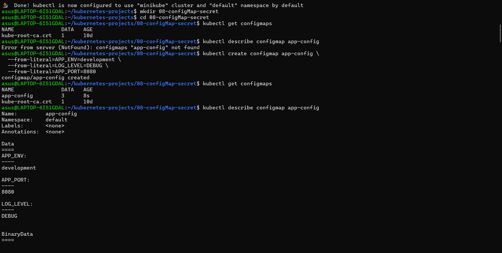
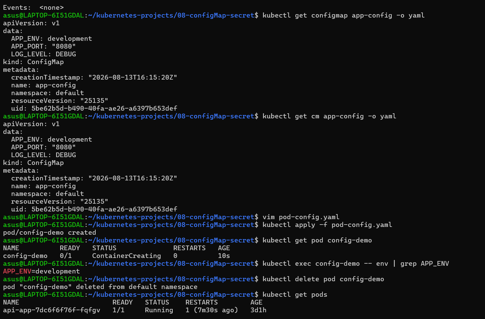
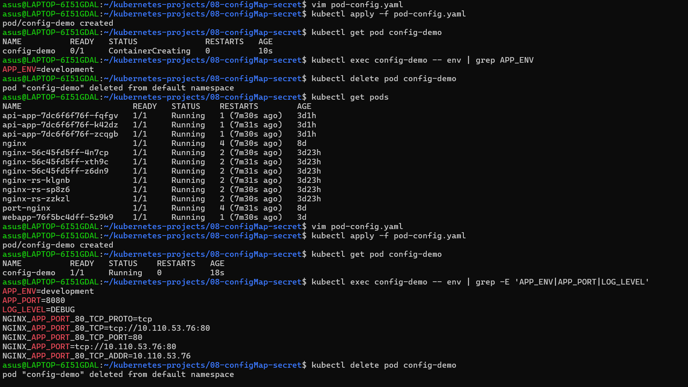
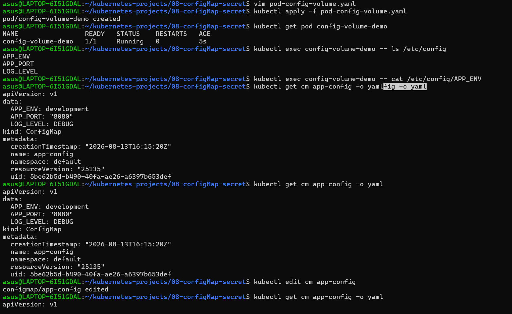
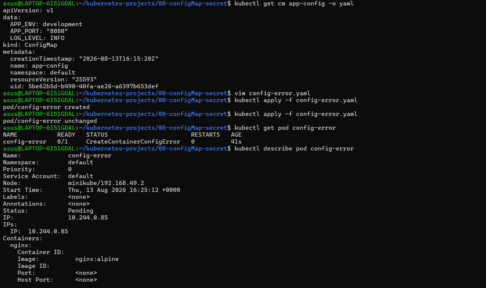
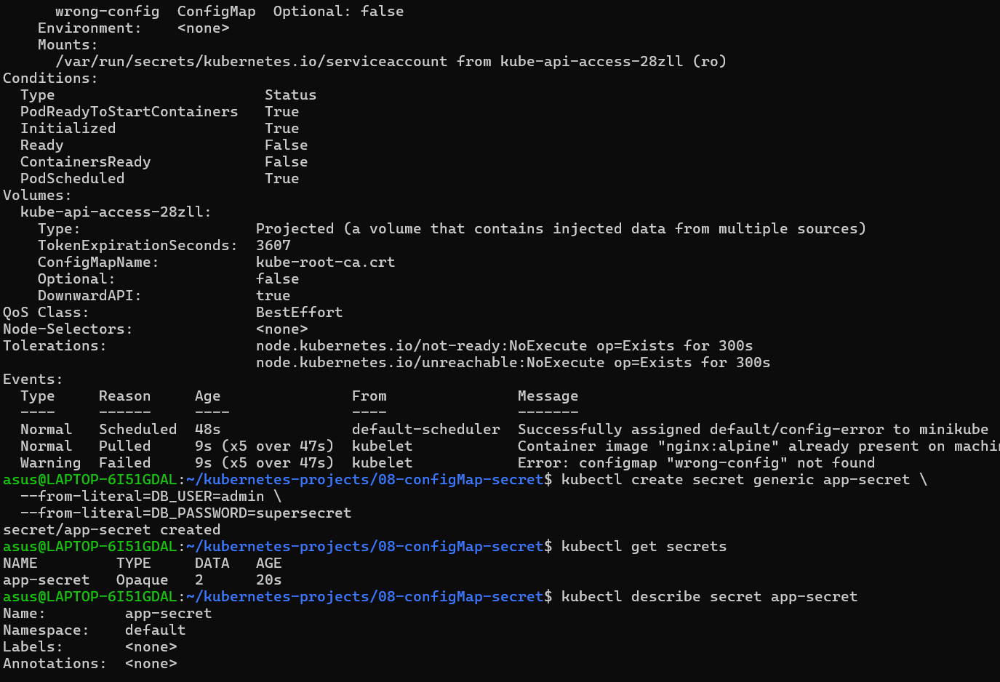
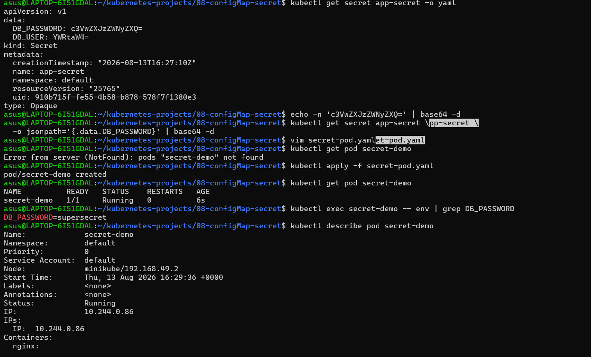
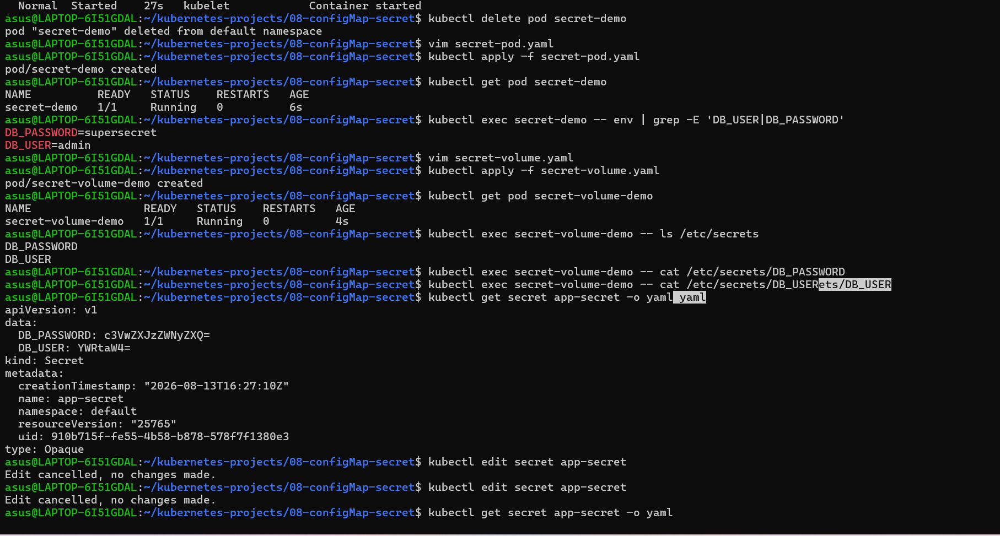
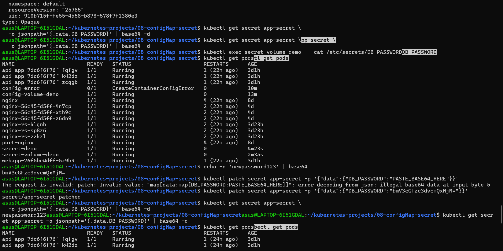

# Kubernetes ConfigMap & Secret

Hands-on practice of Kubernetes ConfigMaps and Secrets for CKA preparation.

## Topics Covered

* ConfigMap creation and inspection
* `configMapKeyRef`
* `envFrom` with ConfigMap
* ConfigMap as volume
* ConfigMap update
* ConfigMap troubleshooting
* Secret creation and inspection
* Base64 encode/decode
* `secretKeyRef`
* `envFrom` with Secret
* Secret as volume
* Secret update
* Secret troubleshooting

## Screenshots

### ConfigMap

### Secret

