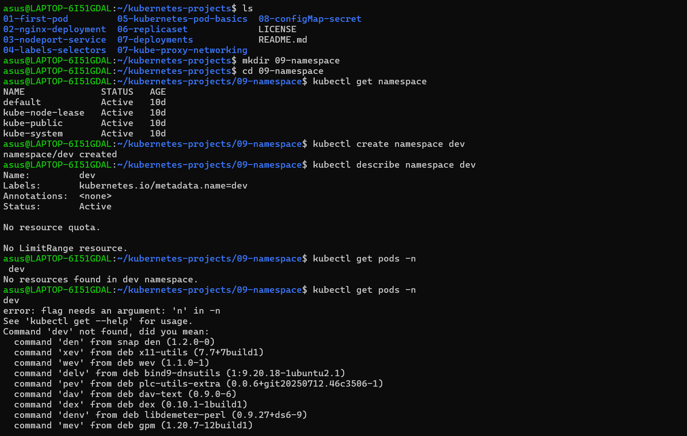
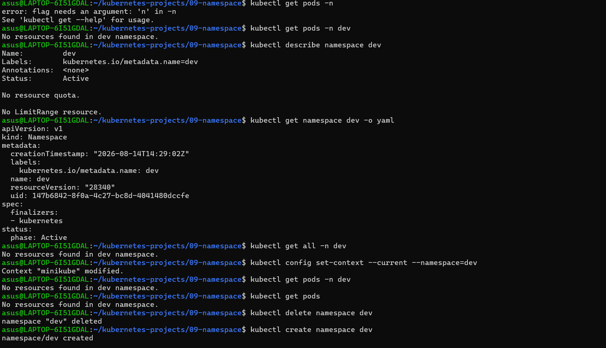
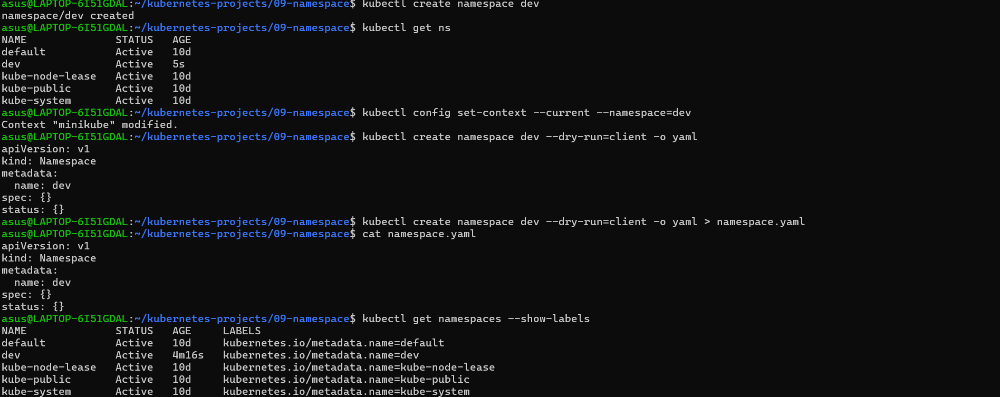

# Kubernetes Namespace

## Commands Practiced

- Create and list namespaces
- Check Pods inside a namespace
- Describe a namespace
- View namespace YAML
- Set default namespace
- Delete and recreate namespace
- Generate namespace YAML using dry-run
- Display namespace labels

## Screenshots

### Namespace Commands

### Namespace Details

### Namespace YAML / Labels

