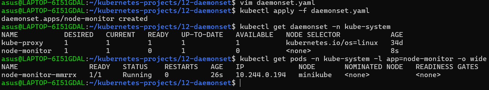
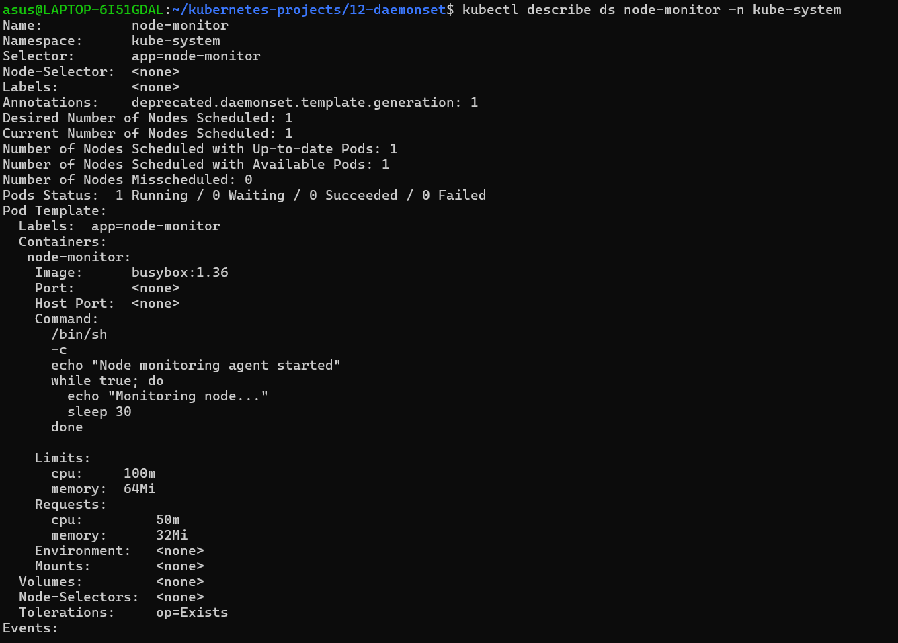
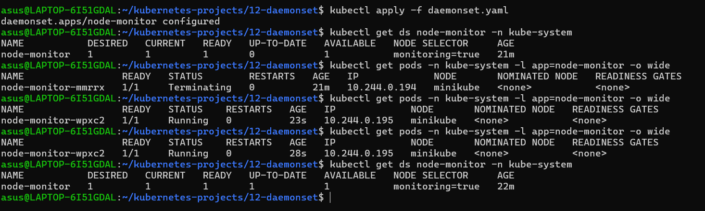
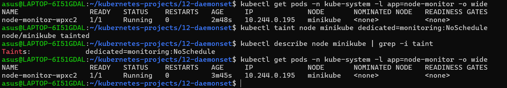
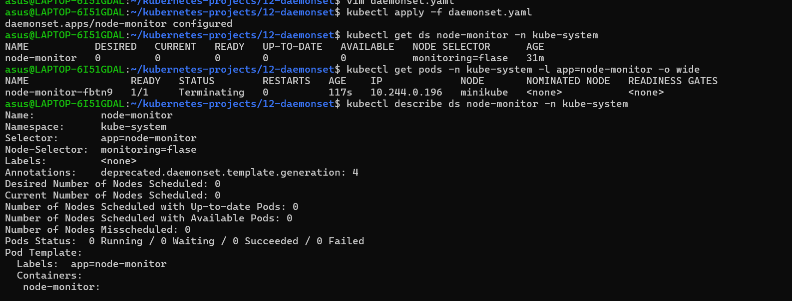

# 12 - Kubernetes DaemonSet

## 📌 Overview

This project demonstrates a practical Kubernetes **DaemonSet** used to deploy a node-level monitoring agent.

### Concepts Covered

* DaemonSet
* NodeSelector
* Node Labels
* Taints & Tolerations
* Rolling Updates
* Troubleshooting

## 🚀 Implementation

### 1. Deploy DaemonSet

```bash
kubectl apply -f daemonset.yaml
kubectl get ds -n kube-system
```

### 2. Verify Pods

```bash
kubectl get pods -n kube-system -l app=node-monitor -o wide
```

DaemonSet maintains **one Pod per eligible node**.

### 3. NodeSelector

Node label:

```bash
kubectl label node minikube monitoring=true
```

DaemonSet:

```yaml
nodeSelector:
  monitoring: "true"
```

### 4. Taint & Toleration

```bash
kubectl taint node minikube dedicated=monitoring:NoSchedule
```

The DaemonSet uses a toleration to run on the tainted node.

### 5. Rolling Update

Updated:

```text
busybox:1.36 → busybox:1.37
```

Verified using:

```bash
kubectl rollout status daemonset/node-monitor -n kube-system
```

### 6. Troubleshooting

Intentionally configured an incorrect `nodeSelector`, identified the scheduling issue, and restored the correct configuration.

## 📸 Screenshots

### DaemonSet Pods



### DaemonSet Status



### NodeSelector



### Taint & Toleration



### Troubleshooting



## 🧠 CKA Key Point

> **DaemonSet = one Pod per eligible node.**
> **NodeSelector = controls which nodes are eligible.**
> **Taint/Toleration = controls whether Pods can run on tainted nodes.**

