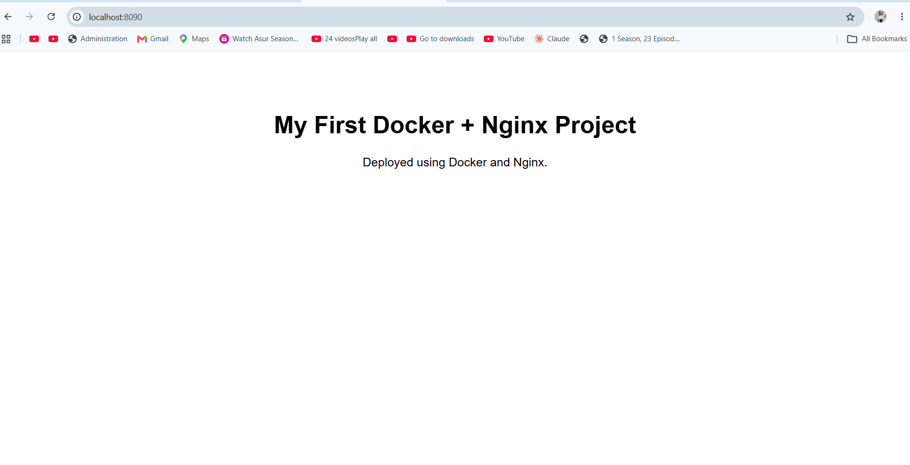

# Static Website using Nginx + Docker

A simple static website containerized using **Docker** and served using **Nginx**.

This project demonstrates the fundamentals of Docker image creation, containerization, Nginx static file serving, port mapping, container troubleshooting, and basic container inspection.

---

## 🚀 Project Overview

In this project, I created a static HTML/CSS website and deployed it inside an Nginx Docker container.

The website is packaged into a custom Docker image based on the lightweight `nginx:alpine` image.

The application is accessible through:

```text
http://localhost:8090
```

---

## 🏗️ Architecture

```text
                    Browser
                       |
                       | HTTP :8090
                       v
                Host Machine
                 Port 8090
                       |
                       | Docker Port Mapping
                       | 8090 -> 80
                       v
              +------------------+
              | Docker Container |
              | static-website   |
              |                  |
              | Nginx :80        |
              |       |          |
              |       v          |
              | /usr/share/      |
              | nginx/html/      |
              |                  |
              | index.html       |
              | style.css        |
              +------------------+
```

---

## 🛠️ Technologies Used

* Docker
* Nginx
* HTML
* CSS
* Linux / WSL2
* Git
* GitHub

---

## 📁 Project Structure

```text
project01-static-website-nginx/
│
├── Dockerfile
├── README.md
│
├── website/
│   ├── index.html
│   └── style.css
│
└── screenshots/
    └── nginx.png
```

---

## 🐳 Dockerfile

```dockerfile
FROM nginx:alpine

RUN rm -rf /usr/share/nginx/html/*

COPY website/ /usr/share/nginx/html/

EXPOSE 80

CMD ["nginx", "-g", "daemon off;"]
```

---

## 🔍 Dockerfile Explanation

### 1. `FROM nginx:alpine`

```dockerfile
FROM nginx:alpine
```

Uses the lightweight Alpine-based Nginx image as the base image.

This avoids installing and configuring Nginx manually.

---

### 2. Remove Default Nginx Website

```dockerfile
RUN rm -rf /usr/share/nginx/html/*
```

Removes the default Nginx web files so the custom website can be served instead.

---

### 3. Copy Website Files

```dockerfile
COPY website/ /usr/share/nginx/html/
```

Copies the website files from the Docker build context into the Nginx web root.

```text
Host
website/
├── index.html
└── style.css

        |
        | COPY
        v

Docker Image
/usr/share/nginx/html/
├── index.html
└── style.css
```

---

### 4. Expose Port 80

```dockerfile
EXPOSE 80
```

Documents that the application inside the container listens on port `80`.

`EXPOSE` does not publish the port to the host.

---

### 5. Start Nginx

```dockerfile
CMD ["nginx", "-g", "daemon off;"]
```

Starts Nginx in the foreground so that Nginx remains the main running process of the container.

---

# 🚀 Running the Project

## 1. Build the Docker Image

From the project root:

```bash
docker build -t static-website-nginx:v1 .
```

The image is created with:

```text
Repository: static-website-nginx
Tag:        v1
```

Verify:

```bash
docker images
```

---

## 2. Run the Container

```bash
docker run -d --name static-website -p 8090:80 static-website-nginx:v1
```

### Port Mapping

```text
Host Port       Container Port
8090      --->       80
```

The host uses port `8090`, while Nginx listens on port `80` inside the container.

---

## 3. Verify the Container

```bash
docker ps --filter "name=static-website"
```

Expected port mapping:

```text
0.0.0.0:8090->80/tcp
```

---

## 4. Access the Website

Open:

```text
http://localhost:8090
```

The browser displays:

```text
My First Docker + Nginx Project

Deployed using Docker and Nginx.
```

---

# 🔎 Container Inspection

The running container can be inspected using `docker exec`.

For example:

```bash
docker exec static-website ls -la /usr/share/nginx/html
```

This verifies that the website files were copied into the Nginx web root.

Expected files:

```text
index.html
style.css
```

The HTML file can also be inspected directly:

```bash
docker exec static-website cat /usr/share/nginx/html/index.html
```

---

# 📜 Checking Container Logs

Nginx logs can be viewed using:

```bash
docker logs static-website
```

The logs confirmed that Nginx started successfully.

Example startup information included:

```text
Configuration complete; ready for start up
nginx/1.31.4
```

---

# 🔧 Troubleshooting

## Host Port Conflict

Initially, I attempted to run the application using host port `8080`:

```bash
docker run -d --name static-website -p 8080:80 static-website-nginx:v1
```

Docker returned a port availability error.

I checked the existing Docker port mappings:

```bash
docker ps --format "table {{.Names}}\t{{.Ports}}"
```

An existing service was using host ports, so I selected another available host port.

The container was successfully started using:

```bash
docker run -d --name static-website -p 8090:80 static-website-nginx:v1
```

The final mapping was:

```text
8090 -> 80
```

---

# 🧰 Useful Docker Commands

### View running containers

```bash
docker ps
```

### View all containers

```bash
docker ps -a
```

### View container logs

```bash
docker logs static-website
```

### Stop the container

```bash
docker stop static-website
```

### Start the container

```bash
docker start static-website
```

### Restart the container

```bash
docker restart static-website
```

### Execute a command inside the container

```bash
docker exec static-website ls -la /usr/share/nginx/html
```

### Remove the container

```bash
docker rm static-website
```

### Remove the image

```bash
docker rmi static-website-nginx:v1
```

---

# 📸 Screenshot

## Running Nginx Docker Container



---

# 🎯 What I Learned

Through this project, I learned:

* Docker image and container fundamentals
* Creating a custom Docker image using a Dockerfile
* Using `nginx:alpine` as a base image
* Serving static files using Nginx
* Understanding the Docker `COPY` instruction
* Understanding container and host ports
* Configuring Docker port mapping
* Building and tagging Docker images
* Running and managing Docker containers
* Inspecting files inside a running container using `docker exec`
* Checking application/container logs using `docker logs`
* Troubleshooting Docker host port conflicts
* Documenting a containerized application for GitHub

---

# 💡 Key Concepts

## Docker Image vs Container

### Docker Image

A Docker image is a read-only template used to create containers.

```text
static-website-nginx:v1
```

### Docker Container

A container is a running instance created from the image.

```text
static-website
```

The relationship is:

```text
Dockerfile
     |
     | docker build
     v
Docker Image
     |
     | docker run
     v
Docker Container
     |
     v
Nginx
     |
     v
Static Website
```

---

# 🌐 Port Mapping

The project uses:

```bash
-p 8090:80
```

This means:

```text
8090 = Host Port
80   = Container Port
```

Traffic flow:

```text
Browser
   |
   | localhost:8090
   v
Host Port 8090
   |
   v
Container Port 80
   |
   v
Nginx
   |
   v
Static Website
```

---

# ⭐ Project Highlights

* Containerized a static website using Docker
* Used Nginx as the web server
* Built a custom Docker image
* Used `nginx:alpine` for a lightweight base image
* Configured host-to-container port mapping
* Verified files inside the running container
* Inspected container logs
* Troubleshot a real host-port conflict
* Documented the project for GitHub

---

# 🔮 Future Improvements

Possible improvements for this project:

* Add a custom Nginx configuration
* Add `.dockerignore`
* Add Docker health checks
* Add security headers
* Optimize the Docker image
* Add GitHub Actions CI/CD
* Deploy the container to AWS EC2
* Add HTTPS using a reverse proxy
* Add monitoring with Prometheus and Grafana

---

# 👩‍💻 Author

**Muskan Patel**

Computer Science Engineering Student | Aspiring DevOps Engineer

